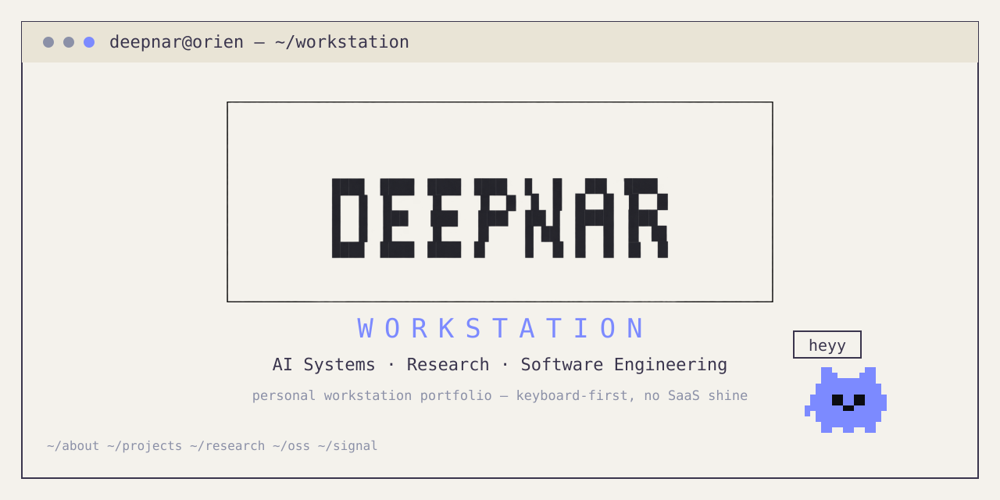
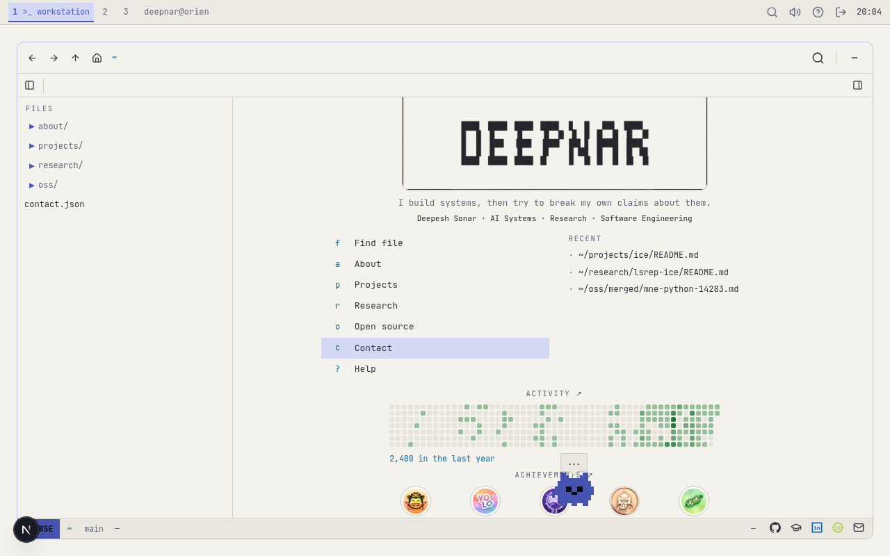
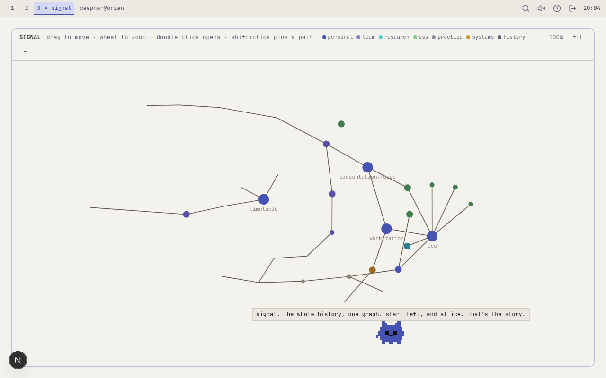

# Deepnar Workstation

`next.js` · `typescript` · `tailwind` · `zustand` · `xterm.js` · `d3-force` · `canvas`



**Live demo:** coming with the first Vercel deploy (this repo has not been
deployed yet — no URL is claimed until then).

An interactive portfolio that behaves like a small research workstation, not
a page of cards. You enter a guest session, open the workstation, and explore
the work as files, terminal sessions, a knowledge graph, and git lanes.

> “heyy” — *pry, the small blue pixel companion who lives in the workstation.
> he notices your cursor sometimes, ignores it sometimes, and keeps his own
> opinions about your buffers.*

## Why it exists

Normal portfolios flatten everything into identical cards. This one keeps the
shape of the work: projects live in a filesystem, research has an evaluation
log, open source is a lane of real merged PRs, history is a graph you can
drag around. If you can use a terminal and a file tree, you already know how
to use this site.

## What makes it different

- **It is a workstation, not a page.** Explorer + buffers + utility dock
  (terminal / agent / web lookup), boot → greeter → desktop, `ctrl+k`
  finder, `?` help. Mobile gets the same workstation with a drawer + bottom
  sheet instead of squeezed columns.
- **Signal** — the whole history as one deterministic, force-directed
  knowledge graph (same layout every load, fit-to-content, magnetic
  proximity picking, keyboard: `]` / `[` / `Enter` / `0`).
- **Deterministic local agent** — the `/` assistant answers from a local
  content index with cited buffers. No model calls, no hallucinated pages.
- **Pry** — an original pixel creature on canvas with his own dialogue per
  location. He once went silent because of a consume-on-speak race; there is
  a retry with rearming now. He has opinions.
- **Orbit** — a tiny playable game with a global leaderboard (Upstash).
- **Evidence, not claims** — certificates, papers, and EGD sheets open in a
  built-in document viewer with zoom / fit / download.
- **Native Catppuccin cursors** with upstream-verbatim hotspots
  (`scripts/gen-cursors.mjs` is the single pipeline; lint enforces it).




## Run locally

```sh
npm install
npm run dev        # http://localhost:3000
npm run lint       # typecheck + secret scan + cursor check
npm run build      # static production build
npm start          # serve the production build
```

Boot → greeter → `[ enter guest session ]` → desktop → open `workstation`.

- Terminal: `ls · tree · cd · cat · open · find · grep · ask · neofetch`
- Buffers: `:e <path>` · `:bd` · `:bnext` · `:bprev`
- Deep links: `?open=~/projects/ice/README.md`
- Desktops: `1` workstation · `2` orbit · `3` signal

## Environment

The site works fully with **no environment variables**. One optional feature
needs them:

| var | where | why |
|---|---|---|
| `NEXT_PUBLIC_UPSTASH_URL` | browser | Orbit global leaderboard (REST) |
| `NEXT_PUBLIC_UPSTASH_TOKEN` | browser | same — public by design (v1), see below |
| `NEXT_PUBLIC_SITE_URL` | build | absolute OG/canonical URLs in production |

Copy `.env.example` to `.env.local` if you want the leaderboard locally.
Without them, Orbit keeps a local best score and everything else is
unaffected. There is deliberately **no `GITHUB_TOKEN`**: GitHub metadata is
synced at authoring time (`npm run sync-github` with local `gh` auth →
committed `src/generated/github.json` → builds ship the JSON).

## Architecture (short)

```
src/app/          next.js routes (static: / + /_not-found)
src/workstation/  explorer · buffers · dock · terminal · palette · agent
src/system/       boot/greeter/desktop · pry (pet) · sound · store wiring
src/apps/         signal graph · orbit game
src/vfs/          virtual filesystem (the site's content tree)
src/content/      verified data only (about · projects · research · oss)
src/lib/          zustand stores · terminal engine · deterministic assistant
public/evidence/  certificates · dipex · egd sheets (intentionally public)
public/research/  papers (intentionally public)
scripts/          tests · screenshots · cursor pipeline · banner · secret scan
```

Content rule: `src/content/` holds verified data, the VFS presents it, and
nothing from private CV source material ships (see `.env.example` +
`scan-secrets`). Full decisions: [`ARCHITECTURE.md`](./ARCHITECTURE.md).

## Privacy / security notes

- No analytics, no cookies, no accounts. Preferences (motion, layout) live
  in your own `localStorage`.
- The Upstash token is a public leaderboard write key: scores are capped,
  trimmed to top-50, keyed by random IDs, carry no PII. Nothing
  valuable depends on it.
- `~/home/deepnar/…` paths in the UI are the site's *virtual* filesystem,
  not the author's machine.
- Preferences: respects `prefers-reduced-motion` (seeds the motion default
  and neuters CSS animation), skip-link first in tab order, Escape closes
  overlays, focusable graph canvas.

## Deploy

Static site — no server runtime. Push to GitHub → import in Vercel →
`npm ci` / `npm run build` / default output. Set the three public env vars
above (Upstash now, `SITE_URL` once the `*.vercel.app` URL is known, then
rebuild).

## License / attribution

- This repo: [MIT](./LICENSE) © 2026 Deepesh Sonar.
- Cursors: Catppuccin (see `public/cursors/LICENSE.catppuccin` +
  `ATTRIBUTION.md`); hotspots re-derived from upstream v2.0.0 metadata.
- Fonts: self-hosted via `next/font/google` (JetBrains Mono, OFL).
- Icons: `lucide-react` (ISC). Terminal: `xterm.js` (MIT).
- GitHub achievement art is displayed as earned-badge imagery alongside
  profile links (see `public/achievements/ATTRIBUTION.md`).
- Papers/certs/EGD sheets under `public/` are the author's own documents,
  published deliberately.
